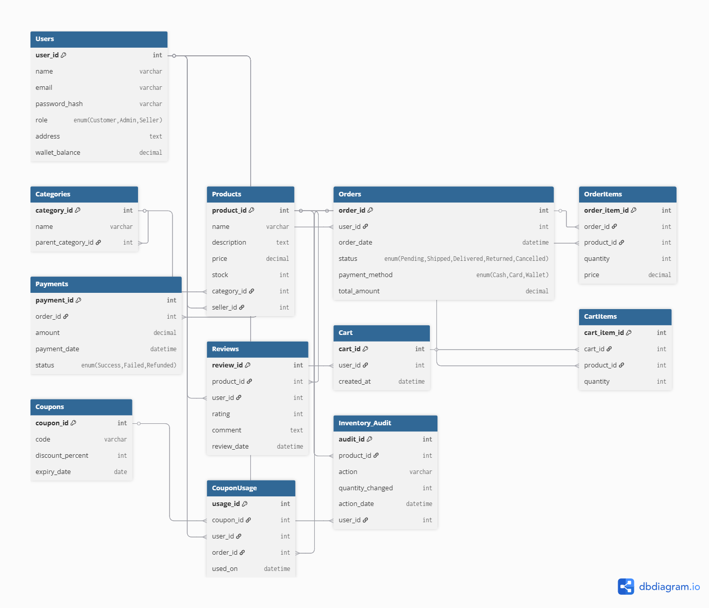

# 🛒 E-Commerce System - MySQL Database

# 🛒 E-Commerce System - MySQL Database


This project is a **major MySQL database system** for an E-Commerce platform.  
It is designed to demonstrate **advanced SQL concepts** including **Triggers, Stored Procedures, Views, Transactions, and Indexes**.  
Ideal for portfolios, resumes, and interviews.

---

## 📌 Features

- **User Management:** Admin, Sellers, and Customers with roles and wallet balance.  
- **Products & Inventory:** Products categorized, with automatic stock tracking and alerts.  
- **Orders & Payments:** Order processing, transactional integrity, and payment tracking.  
- **Cart & Checkout:** Customers can manage carts and place orders.  
- **Reviews & Ratings:** Customers can review products.  
- **Coupons & Discounts:** Manage coupon codes and usage.  
- **Audit & Logging:** Inventory changes tracked for accountability.  
- **Advanced SQL Features:**  
  - Triggers for stock updates  
  - Stored procedures for reports  
  - Views for simplified queries  
  - Transactions for safe order/payment operations  
  - Indexes for performance optimization  

---

## 📂 Project Structure
```
ecommerce-system-mysql-database/
│
├── README.md
├── schema/
│    ├── ecommerce_schema.dbml
│    └── erd_diagram.png
└── sql/
     ├── ecommerce_schema.sql
     ├── sample_data.sql
     ├── procedures_triggers.sql
     ├── views.sql
     ├── transactions.sql
     └── indexes.sql
 
```    

## 🗄️ Database Schema
ER Diagram:  



